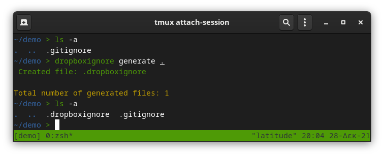

# Command Line Interface

Below you will find the list of supported  commands. For every command, a description and an example will be provided.

## Synopsis

```shell
$ dropboxignore <command> <path> [parameters]
```
## Commands

### `generate`

Generates `dropboxignore` files based on the given path. If a `.dropboxignore` already exists, will not be modified. 
If a `.gitignore` file contains at least one exception pattern, the corresponding`.dropboxignore` file will not be 
created.

**Example:**



### `update`

Updates `.dropboxignore` files in order to add missing patterns from `.gitignore` file.

**Example:**


### `ignore`

Ignores all matched folder or files under the given path using existing `.dropboxignore` files.

**Example:**


### `genupi`

`generate`, `update` & `ignore` using one shortcut command.

**Example:**


### `list`

Lists every ignored folder and file under the given path

**Example:**


### `revert`

Reverts every ignored file or folder under the given path. After running this command, all local files will be sync 
with dropbox.

**Example:**


### `delete`

Deletes all `.dropboxignore` files under the given path.

**Example:**


### `help`

Prints a help message and exits.

**Example:**


## Parameters

`-v` (_verbosity level_ [0-2]) **Default**: `1`

Select a number between 0 and 2 to increase or decrease verbosity. `2` will display debug logs. `0` will display error 
logs only.

`-p` (_matching pattern_) **Default**: `'*'`

Provide a pattern in order to filter matched files. This option is currently available only for `list` command.